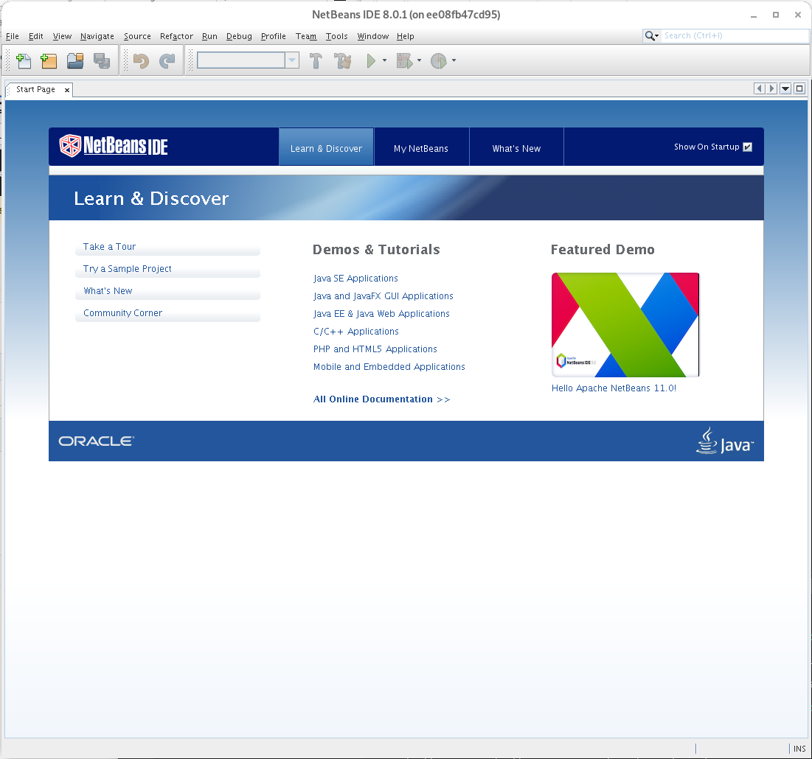
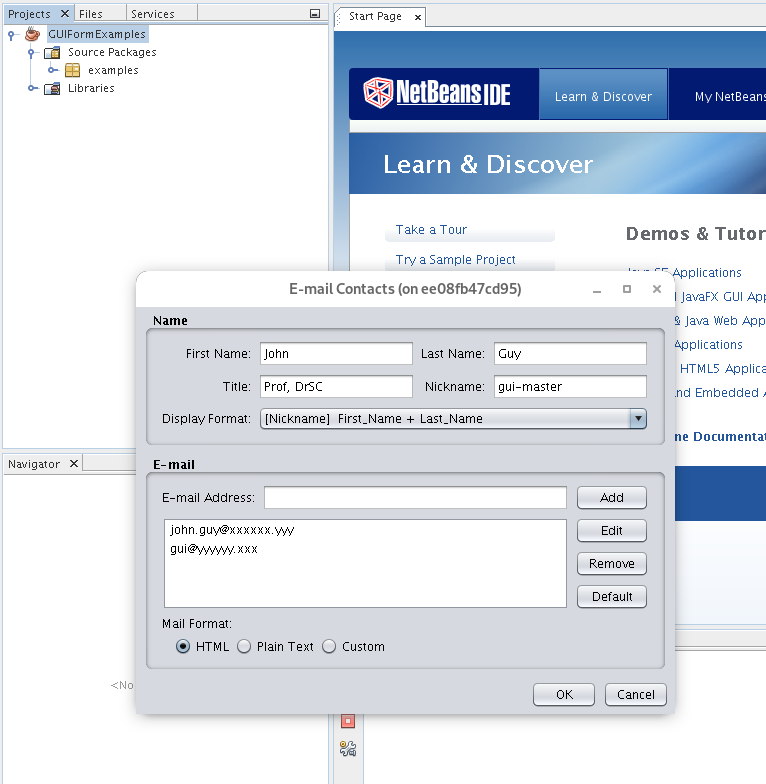

# Run Java NetBeans from a Docker container


## Original sources
Article: http://fabiorehm.com/blog/2014/09/11/running-gui-apps-with-docker/
Repository: https://github.com/fgrehm/docker-netbeans

## Running NetBeans IDE from a Docker container

This container runs the NetBeans IDE from a Linux Docker container.
The differences with the original version are:

* the container automatically builds from Oracle JDK 8 by downloading the JDK `.tar.gz` file from Google Drive
* builds also from Ubuntu 18.04, 
* uses variables for `uid` and `gid`
* slightly modified the script `netbeans` to allow running other Docker tags


## Dockerfile for Ubuntu 18.04


```
FROM f0nzie/oracle-java-8:ubuntu18

RUN apt-get -y update

# RUN DEBIAN_FRONTEND=noninteractive
RUN apt-get install -y libxext-dev libxrender-dev libxtst-dev

ADD state.xml /tmp/state.xml

RUN wget http://download.netbeans.org/netbeans/8.0.1/final/bundles/netbeans-8.0.1-javase-linux.sh -O /tmp/netbeans.sh -q && \
    chmod +x /tmp/netbeans.sh && \
    echo 'Installing netbeans' && \
    /tmp/netbeans.sh --silent --state /tmp/state.xml && \
    rm -rf /tmp/*

ADD run /usr/local/bin/netbeans

RUN chmod +x /usr/local/bin/netbeans && \
    export uid=1001 gid=1001 && \
    mkdir -p /home/developer && \
    echo "developer:x:${uid}:${gid}:Developer,,,:/home/developer:/bin/bash" >> /etc/passwd && \
    echo "developer:x:${uid}:" >> /etc/group && \
    echo "developer ALL=(ALL) NOPASSWD: ALL" > /etc/sudoers && \
    chown developer:developer -R /home/developer

USER developer
ENV HOME /home/developer
WORKDIR /home/developer
CMD /usr/local/bin/netbeans
```


## Build the container

To build the container we type in the terminal:

```
docker build  -f ubuntu18.Dockerfile -t f0nzie/netbeans-jdk8:ubuntu18 .
```

in the same folder where the Dockerfile is located.


## Run the container

There are two ways of running the NetBeans container:

1.  Download and run a script providing the name of the selected image
2.  Type a long command

### Download and run a script

Download a script and make it executable:

```
L=$HOME/bin/netbeans && curl -sL https://github.com/docker-oilgains/netbeans-jdk8/raw/master/netbeans  > $L && chmod +x $L
```

and then run it with:

```
netbeans f0nzie/netbeans-jdk8:ubuntu18
```

which runs a long command inside the script based on the image provided as a parameter.

The script looks like this:

```
#!/bin/bash

docker run -ti --rm \
           -e DISPLAY=$DISPLAY \
           -v /tmp/.X11-unix:/tmp/.X11-unix \
           -v `pwd`:/workspace \
           $1
```

where `$1`  will be waiting for the Docker image name. This allows the flexibility of running NetBeans with different Linux OSes.

### Running a long command

This is equivalent to running the script above with the inconvenience of the typing or recalling the command from the terminal history:

```
docker run -ti --rm -e DISPLAY=$DISPLAY -v /tmp/.X11-unix:/tmp/.X11-unix -v `pwd`:/workspace f0nzie/netbeans-jdk8:ubuntu18
```

This is another way of writing the command:

```
docker run -ti --rm \
	-e DISPLAY=$DISPLAY \
	-v /tmp/.X11-unix:/tmp/.X11-unix \
	-v `pwd`:/workspace \
	f0nzie/netbeans-jdk8:ubuntu18
```

This is a screenshot of NetBeans running from the container:




And this other shows an example of developing a Java Swing application from the this same IDE:




